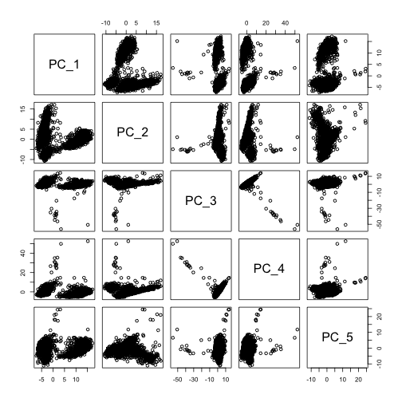

## Overview

This vignette provides an overview of the tiledbsc R package which uses the open source [SOMA data model](https://github.com/single-cell-data/SOMA) to store single-cell data in a collection of TileDB arrays.

With tiledbsc you can:

- convert data from Seurat and other popular single-cell formats into SOMA
- access SOMA data using any of TileDB's APIs
- store your datasets on S3 (or other remote object stores) and slice directly without having to download anything first

In this vignette you'll learn how to:

- ingest Seurat data into TileDB-backed SOMA Collections
- access various components of a dataset
- slice by cell-/feature-identifiers
- query using cell-/feature-level annotations
- update a SOMA with analysis results
- load data from SOMA into R as a Seurat or Bioconductor (i.e., `SummarizedExperiment`) object
- store your data on S3 and register with TileDB Cloud

## Setup


```r
library(tiledbsc)
library(SeuratObject)
#> Attaching sp
```

For this tutorial we'll use a dataset from 10X genomics containing 2,700 peripheral blood mononuclear cells (PBMC) from a healthy donor. The dataset is available on [10X Genomics' website](https://support.10xgenomics.com/single-cell-gene-expression/datasets/1.1.0/pbmc3k).

Use the provided helper function to download the filtered gene/cell matrix from 10X and create a `Seurat` object.


```r
pbmc3k <- dataset_seurat_pbmc3k()
pbmc3k
#> An object of class Seurat 
#> 32738 features across 2700 samples within 1 assay 
#> Active assay: RNA (32738 features, 0 variable features)
```

## Populate a SOMACollection

Our first step is to create a new `SOMACollection` at a specific URI. The URI could be a local filepath, an S3 URI, or as discussed below, a TileDB Cloud URI that automatically registers the dataset on TileDB Cloud.


```r
soco_uri <- file.path(tempdir(), "soco-pbmc3k")

soco <- SOMACollection$new(uri = soco_uri)
#> No SOMACollection currently exists at '/var/folders/rn/r3r2rnt56z98l344kf1tq5ph0000gn/T//RtmpdUqxcd/soco-pbmc3k'
#> Creating new SOMACollection at '/var/folders/rn/r3r2rnt56z98l344kf1tq5ph0000gn/T//RtmpdUqxcd/soco-pbmc3k'
#> No TileDBGroup currently exists at '/var/folders/rn/r3r2rnt56z98l344kf1tq5ph0000gn/T//RtmpdUqxcd/soco-pbmc3k/uns'
#> Creating new TileDBGroup at '/var/folders/rn/r3r2rnt56z98l344kf1tq5ph0000gn/T//RtmpdUqxcd/soco-pbmc3k/uns'
soco
#> <SOMACollection>
#>   uri: /var/folders/rn/r3r2rnt56z98l344kf1tq5ph0000gn/T//RtmpdUqxcd/soco-pbmc3k 
#>   groups: uns
```

Now we use tiledbsc to automatically ingest the various components of the `pbmc3k` object into the new `SOMACollection`.


```r
soco$from_seurat(pbmc3k)
#> No SOMA currently exists at '/var/folders/rn/r3r2rnt56z98l344kf1tq5ph0000gn/T//RtmpdUqxcd/soco-pbmc3k/soma_RNA'
#> Creating new SOMA at '/var/folders/rn/r3r2rnt56z98l344kf1tq5ph0000gn/T//RtmpdUqxcd/soco-pbmc3k/soma_RNA'
#> No AnnotationDataframe found at '/var/folders/rn/r3r2rnt56z98l344kf1tq5ph0000gn/T//RtmpdUqxcd/soco-pbmc3k/soma_RNA/obs'
#> No AnnotationDataframe found at '/var/folders/rn/r3r2rnt56z98l344kf1tq5ph0000gn/T//RtmpdUqxcd/soco-pbmc3k/soma_RNA/var'
#> No AssayMatrixGroup currently exists at '/var/folders/rn/r3r2rnt56z98l344kf1tq5ph0000gn/T//RtmpdUqxcd/soco-pbmc3k/soma_RNA/X'
#> Creating new AssayMatrixGroup at '/var/folders/rn/r3r2rnt56z98l344kf1tq5ph0000gn/T//RtmpdUqxcd/soco-pbmc3k/soma_RNA/X'
#> No AnnotationMatrixGroup currently exists at '/var/folders/rn/r3r2rnt56z98l344kf1tq5ph0000gn/T//RtmpdUqxcd/soco-pbmc3k/soma_RNA/obsm'
#> Creating new AnnotationMatrixGroup at '/var/folders/rn/r3r2rnt56z98l344kf1tq5ph0000gn/T//RtmpdUqxcd/soco-pbmc3k/soma_RNA/obsm'
#> No AnnotationMatrixGroup currently exists at '/var/folders/rn/r3r2rnt56z98l344kf1tq5ph0000gn/T//RtmpdUqxcd/soco-pbmc3k/soma_RNA/varm'
#> Creating new AnnotationMatrixGroup at '/var/folders/rn/r3r2rnt56z98l344kf1tq5ph0000gn/T//RtmpdUqxcd/soco-pbmc3k/soma_RNA/varm'
#> No AnnotationPairwiseMatrixGroup currently exists at '/var/folders/rn/r3r2rnt56z98l344kf1tq5ph0000gn/T//RtmpdUqxcd/soco-pbmc3k/soma_RNA/obsp'
#> Creating new AnnotationPairwiseMatrixGroup at '/var/folders/rn/r3r2rnt56z98l344kf1tq5ph0000gn/T//RtmpdUqxcd/soco-pbmc3k/soma_RNA/obsp'
#> No AnnotationPairwiseMatrixGroup currently exists at '/var/folders/rn/r3r2rnt56z98l344kf1tq5ph0000gn/T//RtmpdUqxcd/soco-pbmc3k/soma_RNA/varp'
#> Creating new AnnotationPairwiseMatrixGroup at '/var/folders/rn/r3r2rnt56z98l344kf1tq5ph0000gn/T//RtmpdUqxcd/soco-pbmc3k/soma_RNA/varp'
#> No TileDBGroup currently exists at '/var/folders/rn/r3r2rnt56z98l344kf1tq5ph0000gn/T//RtmpdUqxcd/soco-pbmc3k/soma_RNA/uns'
#> Creating new TileDBGroup at '/var/folders/rn/r3r2rnt56z98l344kf1tq5ph0000gn/T//RtmpdUqxcd/soco-pbmc3k/soma_RNA/uns'
#> Creating new AnnotationDataframe array with index [obs_id] at '/var/folders/rn/r3r2rnt56z98l344kf1tq5ph0000gn/T//RtmpdUqxcd/soco-pbmc3k/soma_RNA/obs'
#> Ingesting AnnotationDataframe data into: /var/folders/rn/r3r2rnt56z98l344kf1tq5ph0000gn/T//RtmpdUqxcd/soco-pbmc3k/soma_RNA/obs
#> Creating new AnnotationDataframe array with index [var_id] at '/var/folders/rn/r3r2rnt56z98l344kf1tq5ph0000gn/T//RtmpdUqxcd/soco-pbmc3k/soma_RNA/var'
#> Ingesting AnnotationDataframe data into: /var/folders/rn/r3r2rnt56z98l344kf1tq5ph0000gn/T//RtmpdUqxcd/soco-pbmc3k/soma_RNA/var
#> Skipping ingestion of 'data' because it is identical to 'counts'
#> No AssayMatrix found at '/var/folders/rn/r3r2rnt56z98l344kf1tq5ph0000gn/T//RtmpdUqxcd/soco-pbmc3k/soma_RNA/X/counts'
#> Creating new AssayMatrix array with index [var_id,obs_id] at '/var/folders/rn/r3r2rnt56z98l344kf1tq5ph0000gn/T//RtmpdUqxcd/soco-pbmc3k/soma_RNA/X/counts'
#> Ingesting AssayMatrix data into: /var/folders/rn/r3r2rnt56z98l344kf1tq5ph0000gn/T//RtmpdUqxcd/soco-pbmc3k/soma_RNA/X/counts
#> Finished converting Seurat Assay with key [rna_] to SOMA
#> Finished converting Seurat object to SOMACollection
```

Printing the `soco` object shows it comprises 2 members: `RNA`, which contains the RNA assay data, and `uns`, which is a special group for miscellaneous (i.e., unstructured) data.


```r
soco
#> <SOMACollection>
#>   uri: /var/folders/rn/r3r2rnt56z98l344kf1tq5ph0000gn/T//RtmpdUqxcd/soco-pbmc3k 
#>   groups: RNA, uns
```

## Access SOMA Components

As this dataset is unimodal, we'll extract the SOMA containing the RNA data.


```r
soma <- soco$get_member("RNA")
soma
#> <SOMA>
#>   uri: /var/folders/rn/r3r2rnt56z98l344kf1tq5ph0000gn/T//RtmpdUqxcd/soco-pbmc3k/soma_RNA 
#>   arrays: obs, var 
#>   groups: obsm, obsp, uns, varm, varp, X
```

Access the [`AnnotationDataframe`] representing the `obs` array containing cell-level metadata stored in `obs`.


```r
soma$obs
#> <AnnotationDataframe>
#>   uri: /var/folders/rn/r3r2rnt56z98l344kf1tq5ph0000gn/T//RtmpdUqxcd/soco-pbmc3k/soma_RNA/obs 
#>   dimensions: obs_id 
#>   attributes: orig.ident, nCount_RNA, nFeature_RNA
```

Read it into memory as a `data.frame`.


```r
obs <- soma$obs$to_dataframe()
#> Reading AnnotationDataframe into memory from '/var/folders/rn/r3r2rnt56z98l344kf1tq5ph0000gn/T//RtmpdUqxcd/soco-pbmc3k/soma_RNA/obs'
summary(obs)
#>   orig.ident          nCount_RNA     nFeature_RNA   
#>  Length:2700        Min.   :  548   Min.   : 212.0  
#>  Class :character   1st Qu.: 1758   1st Qu.: 690.0  
#>  Mode  :character   Median : 2197   Median : 817.0  
#>                     Mean   : 2367   Mean   : 847.0  
#>                     3rd Qu.: 2763   3rd Qu.: 953.2  
#>                     Max.   :15844   Max.   :3422.0
```

Access the [`AssayMatrix`] representing the `X` array containing the raw RNA
counts.


```r
soma$X$members$counts
#> <AssayMatrix>
#>   uri: /var/folders/rn/r3r2rnt56z98l344kf1tq5ph0000gn/T//RtmpdUqxcd/soco-pbmc3k/soma_RNA/X/counts 
#>   dimensions: var_id, obs_id 
#>   attributes: value
```

Read it into memory as a [`dgTMatrix`][`Matrix::TsparseMatrix-class`].


```r
mat <- soma$X$members$counts$to_matrix()
#> Reading AssayMatrix into memory from '/var/folders/rn/r3r2rnt56z98l344kf1tq5ph0000gn/T//RtmpdUqxcd/soco-pbmc3k/soma_RNA/X/counts'
dim(mat)
#> [1] 16634  2700
```

## Dimension Slicing and Attribute Filtering

`SOMACollection` and `SOMA` objects can be sliced by a combination of obs and var identifiers.


```r
soma$set_query(obs_ids = head(colnames(pbmc3k), 10))
```

This slice is automatically applied to the entire SOMA, so any component read into memory will now only contain the filtered results.


```r
soma$obs$to_dataframe()
#> Reading AnnotationDataframe into memory from '/var/folders/rn/r3r2rnt56z98l344kf1tq5ph0000gn/T//RtmpdUqxcd/soco-pbmc3k/soma_RNA/obs'
#>                     orig.ident nCount_RNA nFeature_RNA
#> AAACATACAACCAC-1 SeuratProject       2421          781
#> AAACATTGAGCTAC-1 SeuratProject       4903         1352
#> AAACATTGATCAGC-1 SeuratProject       3149         1131
#> AAACCGTGCTTCCG-1 SeuratProject       2639          960
#> AAACCGTGTATGCG-1 SeuratProject        981          522
#> AAACGCACTGGTAC-1 SeuratProject       2164          782
#> AAACGCTGACCAGT-1 SeuratProject       2176          783
#> AAACGCTGGTTCTT-1 SeuratProject       2260          790
#> AAACGCTGTAGCCA-1 SeuratProject       1276          533
#> AAACGCTGTTTCTG-1 SeuratProject       1103          550
```

To remove the filter simply reset the query.


```r
soma$reset_query()
summary(soma$obs$to_dataframe())
#> Reading AnnotationDataframe into memory from '/var/folders/rn/r3r2rnt56z98l344kf1tq5ph0000gn/T//RtmpdUqxcd/soco-pbmc3k/soma_RNA/obs'
#>   orig.ident          nCount_RNA     nFeature_RNA   
#>  Length:2700        Min.   :  548   Min.   : 212.0  
#>  Class :character   1st Qu.: 1758   1st Qu.: 690.0  
#>  Mode  :character   Median : 2197   Median : 817.0  
#>                     Mean   : 2367   Mean   : 847.0  
#>                     3rd Qu.: 2763   3rd Qu.: 953.2  
#>                     Max.   :15844   Max.   :3422.0
```

In addition to dimension slicing we can also apply filters using the cell- and feature-level metadata stored in the `obs` and `var` arrays.


```r
soma$set_query(
    obs_attr_filter = seurat_annotations == "B" && nCount_RNA > 1000
)
#> Querying obs with attribute filter
#> Error: No attibute 'seurat_annotations' present.
```

We can load the SOMA slice into memory as a Seurat `Assay`...


```r
soma$to_seurat_assay()
#> Reading AssayMatrix into memory from '/var/folders/rn/r3r2rnt56z98l344kf1tq5ph0000gn/T//RtmpdUqxcd/soco-pbmc3k/soma_RNA/X/counts'
#> Reading AnnotationDataframe into memory from '/var/folders/rn/r3r2rnt56z98l344kf1tq5ph0000gn/T//RtmpdUqxcd/soco-pbmc3k/soma_RNA/var'
#> Assay data with 16634 features for 2700 cells
#> First 10 features:
#>  ENSG00000000003, ENSG00000000419, ENSG00000000457, ENSG00000000460,
#> ENSG00000000938, ENSG00000000971, ENSG00000001036, ENSG00000001084,
#> ENSG00000001167, ENSG00000001460
```

or as a Bioconductor [`SummarizedExperiment`].


```r
if (requireNamespace("SummarizedExperiment", quietly = TRUE)) {
  soma$to_summarized_experiment()
}
#> Reading AssayMatrix into memory from '/var/folders/rn/r3r2rnt56z98l344kf1tq5ph0000gn/T//RtmpdUqxcd/soco-pbmc3k/soma_RNA/X/counts'
#> Reading AnnotationDataframe into memory from '/var/folders/rn/r3r2rnt56z98l344kf1tq5ph0000gn/T//RtmpdUqxcd/soco-pbmc3k/soma_RNA/obs'
#> Reading AnnotationDataframe into memory from '/var/folders/rn/r3r2rnt56z98l344kf1tq5ph0000gn/T//RtmpdUqxcd/soco-pbmc3k/soma_RNA/var'
#> class: SummarizedExperiment 
#> dim: 16634 2700 
#> metadata(0):
#> assays(1): counts
#> rownames(16634): ENSG00000000003 ENSG00000000419 ... ENSG00000273486
#>   ENSG00000273489
#> rowData names(1): gene_name
#> colnames(2700): ATAGATACCATGGT-1 AAACATTGATCAGC-1 ... ACTTGTACCTGTCC-1
#>   GCAACCCTCCTCGT-1
#> colData names(3): orig.ident nCount_RNA nFeature_RNA
```

See `vignette("filtering", package = "tiledbsc")` for more details.

## Adding Analysis Results to a SOMA

The original `pbmc3k` object contains only the raw counts data. Here we'll use `Seurat` to generate new results and add them to the `soma`.

### Add Layer for Normalized Counts

First we normalize the raw counts, which creates a new matrix stored in the `Assay` object.


```r
pbmc3k <- Seurat::NormalizeData(pbmc3k, normalization.method = "LogNormalize")
```

Currently the RNA SOMA's X group contains only a single layer, _counts_.


```r
soma$X
#> <AssayMatrixGroup>
#>   uri: /var/folders/rn/r3r2rnt56z98l344kf1tq5ph0000gn/T//RtmpdUqxcd/soco-pbmc3k/soma_RNA/X 
#>   arrays: counts
```

Add a new `X` layer containing log-normalized counts stored in the Seurat `Assay`'s `data` slot.


```r
soma$from_seurat_assay(
  object = pbmc3k[["RNA"]],
  layers = "data",
  var = FALSE
)
#> No AssayMatrix found at '/var/folders/rn/r3r2rnt56z98l344kf1tq5ph0000gn/T//RtmpdUqxcd/soco-pbmc3k/soma_RNA/X/data'
#> Creating new AssayMatrix array with index [var_id,obs_id] at '/var/folders/rn/r3r2rnt56z98l344kf1tq5ph0000gn/T//RtmpdUqxcd/soco-pbmc3k/soma_RNA/X/data'
#> Ingesting AssayMatrix data into: /var/folders/rn/r3r2rnt56z98l344kf1tq5ph0000gn/T//RtmpdUqxcd/soco-pbmc3k/soma_RNA/X/data
#> Finished converting Seurat Assay with key [rna_] to SOMA
```

Now we can see the SOMA contains 2 `X` layers: `counts` and `data`.


```r
soma$X
#> <AssayMatrixGroup>
#>   uri: /var/folders/rn/r3r2rnt56z98l344kf1tq5ph0000gn/T//RtmpdUqxcd/soco-pbmc3k/soma_RNA/X 
#>   arrays: counts, data
```

### Add Layer for Scaled counts

First, we identify highly variable subset of genes to scale.


```r
var_genes <- VariableFeatures(
  Seurat::FindVariableFeatures(pbmc3k, nfeatures = 2000)
)
```

Then generate the scaled data.


```r
pbmc3k <- Seurat::ScaleData(pbmc3k, features = var_genes)
#> Centering and scaling data matrix
```


And ingest the scaled data into a new `X` layer called `"scale.data"`.


```r
soma$from_seurat_assay(
    object = pbmc3k[["RNA"]],
    layers = "scale.data",
    var = FALSE
)
#> Skipping ingestion of 'data' because it is identical to 'counts'
#> No AssayMatrix found at '/var/folders/rn/r3r2rnt56z98l344kf1tq5ph0000gn/T//RtmpdUqxcd/soco-pbmc3k/soma_RNA/X/scale.data'
#> Creating new AssayMatrix array with index [var_id,obs_id] at '/var/folders/rn/r3r2rnt56z98l344kf1tq5ph0000gn/T//RtmpdUqxcd/soco-pbmc3k/soma_RNA/X/scale.data'
#> Ingesting AssayMatrix data into: /var/folders/rn/r3r2rnt56z98l344kf1tq5ph0000gn/T//RtmpdUqxcd/soco-pbmc3k/soma_RNA/X/scale.data
#> Finished converting Seurat Assay with key [rna_] to SOMA
```

Again, verify the new layer was added.


```r
soma$X
#> <AssayMatrixGroup>
#>   uri: /var/folders/rn/r3r2rnt56z98l344kf1tq5ph0000gn/T//RtmpdUqxcd/soco-pbmc3k/soma_RNA/X 
#>   arrays: counts, data, scale.data
```

### Add Dimensional Reduction Results

We can use a similar workflow for dimensional reduction results, which are stored in either the `obsm` or `varm` slots of a SOMA.


```r
dimreduc_pca <- Reductions(
  Seurat::RunPCA(pbmc3k, features = var_genes),
  slot = "pca"
)
#> PC_ 1 
#> Positive:  ENSG00000101439, ENSG00000011600, ENSG00000204482, ENSG00000204472, ENSG00000087086, ENSG00000085265, ENSG00000090382, ENSG00000167996, ENSG00000163220, ENSG00000158869 
#> 	   ENSG00000025708, ENSG00000197766, ENSG00000100097, ENSG00000143546, ENSG00000163131, ENSG00000100079, ENSG00000197249, ENSG00000066336, ENSG00000142089, ENSG00000197746 
#> 	   ENSG00000126759, ENSG00000130066, ENSG00000216490, ENSG00000103187, ENSG00000163191, ENSG00000119655, ENSG00000131981, ENSG00000084207, ENSG00000103490, ENSG00000116701 
#> Negative:  ENSG00000251562, ENSG00000227507, ENSG00000008517, ENSG00000116824, ENSG00000072818, ENSG00000164543, ENSG00000172543, ENSG00000198821, ENSG00000161570, ENSG00000196329 
#> 	   ENSG00000165272, ENSG00000145649, ENSG00000077984, ENSG00000009790, ENSG00000172005, ENSG00000171476, ENSG00000078596, ENSG00000113088, ENSG00000136997, ENSG00000179144 
#> 	   ENSG00000133134, ENSG00000134954, ENSG00000157978, ENSG00000115085, ENSG00000145220, ENSG00000166405, ENSG00000145779, ENSG00000105374, ENSG00000139187, ENSG00000164483 
#> PC_ 2 
#> Positive:  ENSG00000105374, ENSG00000180644, ENSG00000077984, ENSG00000145649, ENSG00000100453, ENSG00000137441, ENSG00000172543, ENSG00000115523, ENSG00000100450, ENSG00000159674 
#> 	   ENSG00000129277, ENSG00000203747, ENSG00000161570, ENSG00000198821, ENSG00000143185, ENSG00000169583, ENSG00000196139, ENSG00000122862, ENSG00000171476, ENSG00000109861 
#> 	   ENSG00000075234, ENSG00000196154, ENSG00000135046, ENSG00000008517, ENSG00000163453, ENSG00000115738, ENSG00000075624, ENSG00000143184, ENSG00000239713, ENSG00000164483 
#> Negative:  ENSG00000105369, ENSG00000156738, ENSG00000100721, ENSG00000196735, ENSG00000204287, ENSG00000179344, ENSG00000247982, ENSG00000007312, ENSG00000196126, ENSG00000019582 
#> 	   ENSG00000223865, ENSG00000204257, ENSG00000237541, ENSG00000198502, ENSG00000231389, ENSG00000242574, ENSG00000132185, ENSG00000122986, ENSG00000227507, ENSG00000095585 
#> 	   ENSG00000226777, ENSG00000083454, ENSG00000140968, ENSG00000254709, ENSG00000133789, ENSG00000138639, ENSG00000163683, ENSG00000167641, ENSG00000132704, ENSG00000154102 
#> PC_ 3 
#> Positive:  ENSG00000196735, ENSG00000105369, ENSG00000007312, ENSG00000179344, ENSG00000223865, ENSG00000019582, ENSG00000231389, ENSG00000156738, ENSG00000196126, ENSG00000198502 
#> 	   ENSG00000204287, ENSG00000237541, ENSG00000100721, ENSG00000247982, ENSG00000242574, ENSG00000204257, ENSG00000122986, ENSG00000132185, ENSG00000140968, ENSG00000095585 
#> 	   ENSG00000226777, ENSG00000163683, ENSG00000166428, ENSG00000083454, ENSG00000254709, ENSG00000133789, ENSG00000086730, ENSG00000034510, ENSG00000132465, ENSG00000170476 
#> Negative:  ENSG00000163736, ENSG00000163737, ENSG00000168497, ENSG00000113140, ENSG00000127920, ENSG00000154146, ENSG00000169704, ENSG00000150681, ENSG00000101162, ENSG00000120885 
#> 	   ENSG00000180573, ENSG00000236304, ENSG00000005961, ENSG00000010278, ENSG00000088726, ENSG00000104267, ENSG00000171611, ENSG00000111644, ENSG00000108960, ENSG00000166681 
#> 	   ENSG00000161911, ENSG00000124491, ENSG00000176783, ENSG00000184702, ENSG00000130830, ENSG00000102804, ENSG00000166091, ENSG00000272053, ENSG00000101335, ENSG00000185245 
#> PC_ 4 
#> Positive:  ENSG00000196735, ENSG00000180573, ENSG00000163737, ENSG00000105369, ENSG00000168497, ENSG00000007312, ENSG00000163736, ENSG00000127920, ENSG00000179344, ENSG00000113140 
#> 	   ENSG00000156738, ENSG00000019582, ENSG00000169704, ENSG00000223865, ENSG00000150681, ENSG00000154146, ENSG00000171611, ENSG00000010278, ENSG00000237541, ENSG00000236304 
#> 	   ENSG00000120885, ENSG00000101162, ENSG00000104267, ENSG00000196126, ENSG00000231389, ENSG00000005961, ENSG00000204287, ENSG00000100721, ENSG00000088726, ENSG00000111644 
#> Negative:  ENSG00000026025, ENSG00000143546, ENSG00000197956, ENSG00000196154, ENSG00000034510, ENSG00000163220, ENSG00000008517, ENSG00000179144, ENSG00000197747, ENSG00000100079 
#> 	   ENSG00000162444, ENSG00000172005, ENSG00000085265, ENSG00000090382, ENSG00000116824, ENSG00000163221, ENSG00000110077, ENSG00000082074, ENSG00000163191, ENSG00000165272 
#> 	   ENSG00000133574, ENSG00000110203, ENSG00000135046, ENSG00000251562, ENSG00000204472, ENSG00000196329, ENSG00000169429, ENSG00000126709, ENSG00000186854, ENSG00000141505 
#> PC_ 5 
#> Positive:  ENSG00000227507, ENSG00000026025, ENSG00000165272, ENSG00000180817, ENSG00000172005, ENSG00000166803, ENSG00000116824, ENSG00000172725, ENSG00000115165, ENSG00000082074 
#> 	   ENSG00000008517, ENSG00000102871, ENSG00000164111, ENSG00000123416, ENSG00000189159, ENSG00000110958, ENSG00000176890, ENSG00000078596, ENSG00000103187, ENSG00000169508 
#> 	   ENSG00000184009, ENSG00000145779, ENSG00000165629, ENSG00000009790, ENSG00000133574, ENSG00000117450, ENSG00000122952, ENSG00000146386, ENSG00000166681, ENSG00000157978 
#> Negative:  ENSG00000100453, ENSG00000137441, ENSG00000105374, ENSG00000115523, ENSG00000180644, ENSG00000129277, ENSG00000077984, ENSG00000159674, ENSG00000145649, ENSG00000100450 
#> 	   ENSG00000169583, ENSG00000143185, ENSG00000172543, ENSG00000075234, ENSG00000196139, ENSG00000161570, ENSG00000163453, ENSG00000143184, ENSG00000143546, ENSG00000006075 
#> 	   ENSG00000011600, ENSG00000171476, ENSG00000117281, ENSG00000135077, ENSG00000163220, ENSG00000158869, ENSG00000168229, ENSG00000100079, ENSG00000162444, ENSG00000163221
```

Add the Seurat `DimReduc` object to the SOMA.


```r
soma$add_seurat_dimreduction(
    dimreduc_pca,
    technique = "pca"
)
#> No AnnotationMatrix found at '/var/folders/rn/r3r2rnt56z98l344kf1tq5ph0000gn/T//RtmpdUqxcd/soco-pbmc3k/soma_RNA/varm/dimreduction_pca'
#> Creating new AnnotationMatrix array with index [var_id] at '/var/folders/rn/r3r2rnt56z98l344kf1tq5ph0000gn/T//RtmpdUqxcd/soco-pbmc3k/soma_RNA/varm/dimreduction_pca'
#> Ingesting AnnotationMatrix data into: /var/folders/rn/r3r2rnt56z98l344kf1tq5ph0000gn/T//RtmpdUqxcd/soco-pbmc3k/soma_RNA/varm/dimreduction_pca
#> No AnnotationMatrix found at '/var/folders/rn/r3r2rnt56z98l344kf1tq5ph0000gn/T//RtmpdUqxcd/soco-pbmc3k/soma_RNA/obsm/dimreduction_pca'
#> Creating new AnnotationMatrix array with index [obs_id] at '/var/folders/rn/r3r2rnt56z98l344kf1tq5ph0000gn/T//RtmpdUqxcd/soco-pbmc3k/soma_RNA/obsm/dimreduction_pca'
#> Ingesting AnnotationMatrix data into: /var/folders/rn/r3r2rnt56z98l344kf1tq5ph0000gn/T//RtmpdUqxcd/soco-pbmc3k/soma_RNA/obsm/dimreduction_pca
#> <SOMA>
#>   uri: /var/folders/rn/r3r2rnt56z98l344kf1tq5ph0000gn/T//RtmpdUqxcd/soco-pbmc3k/soma_RNA 
#>   arrays: obs, var 
#>   groups: obsm, obsp, uns, varm, varp, X
```

The SOMA now contains 2 new arrays, one within the `obsm` group storing the cell embeddings


```r
soma$obsm
#> <AnnotationMatrixGroup>
#>   uri: /var/folders/rn/r3r2rnt56z98l344kf1tq5ph0000gn/T//RtmpdUqxcd/soco-pbmc3k/soma_RNA/obsm 
#>   arrays: dimreduction_pca
```

and a second within the `varm` group storing the feature loadings.


```r
soma$varm
#> <AnnotationMatrixGroup>
#>   uri: /var/folders/rn/r3r2rnt56z98l344kf1tq5ph0000gn/T//RtmpdUqxcd/soco-pbmc3k/soma_RNA/varm 
#>   arrays: dimreduction_pca
```

Either of these can be accessed and queried directly, which is often useful for visualization applications.


```r
obsm_pca <- soma$obsm$get_member("dimreduction_pca")
obsm_pca
#> <AnnotationMatrix>
#>   uri: /var/folders/rn/r3r2rnt56z98l344kf1tq5ph0000gn/T//RtmpdUqxcd/soco-pbmc3k/soma_RNA/obsm/dimreduction_pca 
#>   dimensions: obs_id 
#>   attributes: PC_1, PC_2, PC_3, PC_4, PC_5, PC_6, PC_7, PC_8, PC_9, PC_10, PC_11, PC_12, PC...
```

Here we'll load the cell embeddings as a `matrix` and visualize the first 5 PCs.


```r
cell_pcs <- obsm_pca$to_matrix()
#> Reading AnnotationMatrix into memory from '/var/folders/rn/r3r2rnt56z98l344kf1tq5ph0000gn/T//RtmpdUqxcd/soco-pbmc3k/soma_RNA/obsm/dimreduction_pca'
pairs(cell_pcs[, 1:5])
```



## Populate a SOMACollection in TileDB Cloud

You can ingest a Seurat object into an S3 `SOMACollection` that's automatically registered with TileDB Cloud using a special URI composed of:

-   your TileDB namespace
-   an S3 bucket where the dataset will be created

and running the same initialization/ingestion steps we performed earlier:

```r
soco <- SOMACollection$new("tiledb://<namespace>/s3://<bucket>/pbmc3k-soco")
soco$from_seurat(pbmc3k)
```

Note this assumes you:

-   have a TileDB Cloud account
-   registered [cloud
    credentials](https://cloud.tiledb.com/user-settings/credentials) for
    AWS
-   provided a [default S3 storage
    path](https://cloud.tiledb.com/user-settings/storage-paths)
-   are [logged into TileDB
    Cloud](https://tiledb-inc.github.io/TileDB-Cloud-R/articles/Login.html)
    in your environment

You can then view the new SOMACollection directly on TileDB Cloud where you can
inspect the various dataset components, share securely, view activity logs, and more. For example, here's the TileDB Cloud view of the `pbmc3k` dataset we just ingested: [`aaronwolen/pbmc3k-soco`](https://cloud.tiledb.com/groups/aaronwolen/68ffab71-b090-42c9-8d8b-977d00979257/overview).

You can also securely access the dataset directly via R (or Python) using its TileDB Cloud URI, `tiledb://aaronwolen/pbmc3k-soco`.
